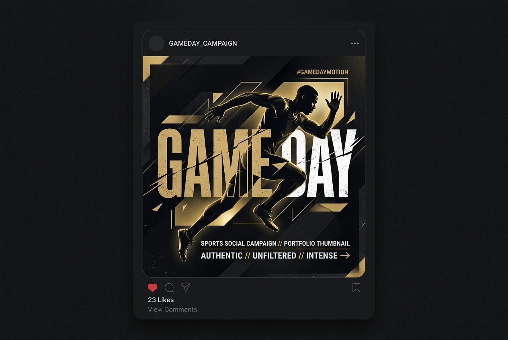

# Premium Studio Portfolio — Graphic Designer & Video Editor

A personal, production-ready creative studio portfolio website built for a freelance **Graphic Designer and Video Editor**. Designed with a dark aesthetic, typography, micro-interactions, responsive grid layouts, and a scalable project architecture.



---

## ✨ Features

- **Dark-Themed Visual Identity**: Sophisticated charcoal background (`#0e0e0f`), crisp off-white typography, and refined warm gold accent (`#c9a96e`).
- **Typography Pairing**: *Playfair Display* for serif headlines + *Inter* for UI copy.
- **Centralized Configuration (`js/config.js`)**: Update Thevindu Kottege, title, bio, email, social links, and resume link in a single file to update the entire site.
- **CMS-Style Portfolio Data (`js/projects.js`)**: Easily add, edit, or remove portfolio projects without writing any HTML.
- **Dynamic Case Study Template (`project.html`)**: Individual case study pages rendered dynamically with routing for Vercel (`/project/slug-name`).
- **Interactive Work Filter (`work.html`)**: Smooth category filtering across Graphic Design, Video Editing, Photography, Motion Graphics, and 3D.
- **High-Converting Contact Form (`contact.html`)**: Interactive form validation, success/error UI states, and ready to connect to Formspree, Netlify Forms, or EmailJS.
- **Mobile Responsive & Accessible**: Custom hamburger navigation, touch support, semantic HTML5, and `prefers-reduced-motion` compliance.

---

## 🛠️ Project Structure

```
.
├── index.html            # Homepage (Hero, Selected Work, Services, CTA)
├── work.html             # All Projects Grid with Category Filters
├── project.html          # Dynamic Case Study Page Template
├── about.html            # Bio, Skills, Software Tools, Experience Timeline
├── contact.html          # Contact Form & Social Links
├── vercel.json           # Vercel Routing, Clean URLs & Cache Headers
├── .gitignore            # Git exclusion rules
│
├── css/
│   ├── variables.css     # Design Tokens & Theme Variables
│   ├── base.css          # CSS Reset & Base Typography
│   ├── components.css    # Nav, Buttons, Cards, Forms, Footer
│   ├── animations.css    # Keyframes, Scroll Reveal, Micro-interactions
│   └── responsive.css    # Media Queries (Mobile, Tablet, Desktop)
│
├── js/
│   ├── config.js         # ⭐ CENTRAL SITE CONFIG (Edit Thevindu Kottege & links here!)
│   ├── projects.js       # ⭐ PORTFOLIO DATA STORE (Add your projects here!)
│   ├── main.js           # Shared Nav, Scroll Reveal & Footer Rendering
│   ├── home.js           # Featured Grid & Skill Bar Animations
│   ├── work.js           # Work Page Category Filter Logic
│   ├── project.js        # Dynamic Case Study Renderer
│   └── contact.js        # Form Validation & Submission Handler
│
└── assets/
    ├── favicon.svg       # Brand Initial Favicon Badge
    └── images/           # High-resolution project imagery
```

---

## 🚀 How to Customize

### 1. Update Personal Info
Open `js/config.js` and update your details:
```javascript
const CONFIG = {
  name: "Thevindu Kottege",
  title: "Graphic Designer & Video Editor",
  email: "hello@thevindukottege.com",
  social: {
    behance: "https://www.behance.net/yourname",
    linkedin: "https://www.linkedin.com/in/yourname",
    instagram: "https://www.instagram.com/yourname",
  },
  resumeUrl: "assets/resume.pdf",
};
```

### 2. Configure Hero Background Atmosphere
Open `js/config.js` to customize the background image and its subtle visibility behind the homepage hero:
```javascript
heroBackgroundImage: "assets/images/proj5_product_photo.jpg", // Local image or Google Drive link/ID
heroBackgroundOpacity: 0.18, // 0.12 - 0.25 recommended for subtle, high-contrast dark ambiance
```

### 3. Add New Portfolio Projects
Open `js/projects.js` and add your project object to the `PROJECTS` array (supports Google Drive links or local images):
```javascript
{
  id: 9,
  slug: "my-awesome-project",
  title: "My Awesome Project",
  category: "graphic-design",
  categoryLabel: "Graphic Design",
  year: "2026",
  description: "Short project summary.",
  role: "Graphic Designer",
  tools: ["Photoshop", "Illustrator"],
  thumbnail: "assets/images/my-project.jpg", // or Google Drive link / ID
  heroImage: "assets/images/my-project-hero.jpg",
  brief: "What the client needed...",
  goal: "What we aimed to achieve...",
  myRole: "What I created...",
  featured: true,
}
```

### 4. Add Photographs & Series via Google Drive
Open `js/photography-data.js` to manage your photography journal:
1. **Upload your photo** to your Google Drive folder.
2. **Right-click > Share > Set "General access" to "Anyone with the link can view"** > Copy link.
3. **Paste the link or file ID** directly into `PHOTOGRAPHY_PHOTOS` or `PHOTOGRAPHY_SERIES`:
```javascript
{
  id: 9,
  title: "Sunset Over the Coast",
  category: "Landscape",
  seriesId: "southern-coast", // optional series association
  date: "January 2026",
  location: "Mirissa, Sri Lanka",
  image: "https://drive.google.com/file/d/YOUR_FILE_ID/view?usp=sharing", // or just "YOUR_FILE_ID"
  aspectRatio: "landscape", // 'portrait', 'landscape', 'wide', 'tall', or 'square'
  description: "Golden rays breaking through monsoon clouds over the Indian Ocean.",
  exif: {
    camera: "Sony A7 IV",
    lens: "FE 24-70mm f/2.8 GM II",
    settings: "1/500s · f/4.0 · ISO 100",
  },
}
```
The website's `ImageUtils` engine automatically converts Google Drive links into direct, high-speed CDN URLs and includes graceful fallbacks if permissions are missing.

---

## 🌐 How to Upload to GitHub & Host on Vercel

### Step 1: Push to GitHub

1. Open your terminal / command prompt in this project folder:
   ```bash
   cd "C:\Users\ASUS\Documents\Antigravity\Proj.1 - Portfolio"
   ```

2. Initialize Git and commit the files:
   ```bash
   git init
   git add .
   git commit -m "Initial commit of portfolio website"
   ```

3. Create a new repository on [GitHub](https://github.com/new) named `portfolio` (keep it public or private).

4. Link and push your local code:
   ```bash
   git remote add origin https://github.com/YOUR_GITHUB_USERNAME/portfolio.git
   git branch -M main
   git push -u origin main
   ```

---

### Step 2: Deploy on Vercel

1. Go to [Vercel.com](https://vercel.com) and log in (or sign up using your GitHub account).
2. Click **"Add New..."** → **"Project"**.
3. Select your **`portfolio`** repository from GitHub and click **"Import"**.
4. Leave all build settings as default (Framework Preset: *Other* / *Other (Static Website)*).
5. Click **"Deploy"**.

✨ Your website will be live in seconds at `https://portfolio.vercel.app` (or your custom domain)!

---

## 📜 License

Distributed under the MIT License. See `LICENSE` for more information.
